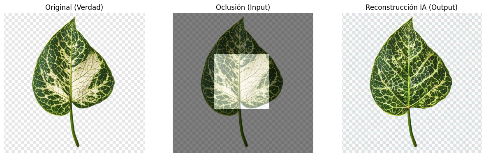

# Agricultural Computer Vision: Leaf Occlusion Repair (Inpainting)

## Project Overview
This repository contains a Proof of Concept (PoC) designed to address a specific challenge in automated plant analysis and vertical farming: **leaf occlusion**.

In high-density agricultural environments, overlapping leaves often obstruct the view of computer vision systems, leading to incomplete data regarding plant health and growth metrics. This project demonstrates the use of **Generative AI (Inpainting)** to artificially reconstruct the occluded parts of a plant, aiming to restore visual data for downstream analysis.

## Technical Solution
The solution utilizes **Latent Diffusion Models** to infer and regenerate missing biological textures.

* **Architecture:** The pipeline is built upon the **Stable Diffusion Inpainting** model, which leverages a U-Net architecture with cross-attention mechanisms.
* **Methodology:**
    1.  **Input:** High-resolution RGB images of plant leaves.
    2.  **Masking:** Generation of a binary mask to simulate occlusion (simulating a leaf covering another).
    3.  **Inference:** The model utilizes the context of the unmasked area (vein structure, color, lighting) to predict and generate the missing pixels within the masked region.
    4.  **Output:** A seamless reconstruction of the leaf structure.

## Results
The image below demonstrates the model's capability to reconstruct organic textures.
* **Left:** Original Ground Truth.
* **Center:** Occluded Input (Masked).
* **Right:** AI Reconstruction.

## Technology Stack
* **Language:** Python 3.x
* **Deep Learning Framework:** PyTorch
* **Libraries:** Hugging Face Diffusers, Transformers, Accelerate
* **Image Processing:** OpenCV, PIL (Python Imaging Library)
* **Environment:** Google Colab (T4 GPU acceleration)

## Usage
The core logic is contained within the Jupyter Notebook `Leaf_Inpainting_POC.ipynb`.
To reproduce the results:
1.  Open the notebook in a GPU-enabled environment (e.g., Google Colab).
2.  Install the required dependencies listed in the first cell.
3.  Run the pipeline to download the sample image and perform the inpainting inference.
